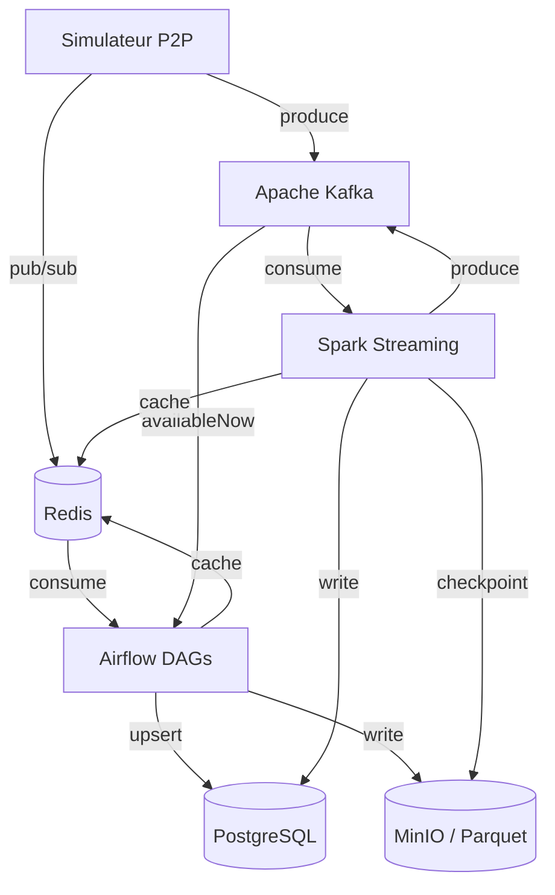

# Architecture SPOTIFY

> **À compléter par votre groupe** — Ce document doit décrire VOTRE architecture, pas celle de référence.

---

## Vision d'ensemble

```
[Insérer ici votre diagramme d'architecture]
Outil recommandé : draw.io, Excalidraw, ou Mermaid (ci-dessous)
```



---

## Décisions architecturales

### ETL vs ELT — Mapping par pipeline

| Pipeline | Approche | Justification |
|----------|----------|---------------|
| catalog_ingestion | ETL | Transformation et dédoublonnage en Python avant insertion pour garantir un catalogue propre. |
| streaming_events | ETL | Validation et enrichissement (jointure avec catalogue) au moment de l'ingestion pour faciliter les agrégations. |
| aggregation | ELT | Les calculs lourds (Top 50, Stats) sont délégués au moteur SQL de PostgreSQL pour maximiser la performance. |
| recommendation | ELT | Analyse de l'historique directement en SQL/Pandas pour extraire les affinités utilisateurs. |

### Partitionnement Parquet

Expliquer ici votre stratégie de partitionnement des fichiers Parquet sur MinIO.

```
spotify-parquet/
└── listening_events/
    └── date=2025-01-15/
        └── hour=14/
            └── part-00000.parquet
```

**Pourquoi cette structure ?**
Permet une lecture optimisée par Spark (Phase 2) en utilisant le "partition pruning". Les requêtes analytiques sur une période précise ne scannent que les sous-dossiers concernés, réduisant drastiquement les I/O.

### Topics Kafka — Stratégie de partitionnement

| Topic | Partitions | Clé | Justification |
|-------|-----------|-----|---------------|
| listening_events | 6 | user_id | Garantit que tous les événements d'un même utilisateur arrivent dans la même partition (important pour Spark stateful). |
| p2p_network_events | 6 | peer_id | Permet de monitorer la charge réseau par peer de façon cohérente. |
| catalog_updates | 3 | track_id | Mise à jour atomique des métadonnées par morceau. |
| fraud_alerts | 3 | user_id | Centralisation des alertes pour un utilisateur donné. |

**Pourquoi `user_id` comme clé pour `listening_events` ?**
Cela assure l'ordre chronologique des écoutes pour un utilisateur donné au sein d'une partition, ce qui est crucial pour détecter des comportements anormaux (fraude) ou construire un profil d'affinité sans désordre temporel.

---

## Choix techniques

### Pourquoi CeleryExecutor (pas KubernetesExecutor) ?

Nous avons choisi `CeleryExecutor` pour sa simplicité de mise en œuvre dans un environnement local (Docker Compose). Il permet une exécution parallélisée des tâches sur plusieurs workers sans la complexité de gestion d'un cluster Kubernetes, tout en étant plus performant que le `SequentialExecutor`.

### Gestion des secrets

Les secrets (mots de passe DB, accès MinIO) sont gérés via un fichier `.env` non commit (basé sur `.env.example`). Airflow les récupère via les variables d'environnement définies dans le `docker-compose.yml`, assurant une séparation entre le code source et les credentials.

---

## Architecture Lambda — Batch + Speed Layer

```
Speed layer  : Simulateur → Kafka → Spark → PostgreSQL (realtime_*) + Redis
Batch layer  : Simulateur → Kafka (availableNow) → Airflow → PostgreSQL (daily_*) + MinIO
Serving layer: PostgreSQL + Redis ← consommé par les clients
```

**Ce qui est en batch et pourquoi :**
- L'ingestion du catalogue des labels (fichiers JSON statiques).
- Le calcul des agrégats quotidiens (plus efficace en batch de nuit pour économiser les ressources).
- La génération des recommandations personnalisées (calcul complexe, un rafraîchissement toutes les 24h est suffisant pour l'expérience utilisateur).

**Ce qui est en streaming et pourquoi :**
- L'ingestion des événements d'écoute (micro-batch de 5 min) pour alimenter le dashboard en continu.
- Les futurs calculs de tendances (Top 10 Live) et la détection de fraude qui nécessitent une réactivité à la seconde (Phase 2).

---

## Schémas d'événements

### listening_event

```json
{
  "event_id":    "uuid",
  "user_id":     "uuid",
  "track_id":    "uuid",
  "source_peer": "uuid",
  "timestamp":   "2025-01-15T14:30:00Z",
  "duration_ms": 45000,
  "device_type": "mobile",
  "geo_country": "FR",
  "completed":   true,
  "event_source": "p2p"
}
```

### p2p_network_event

```json
{
  "event_id":   "uuid",
  "event_type": "chunk_transfer",
  "peer_id":    "uuid",
  "target_peer": "uuid",
  "track_id":   "uuid",
  "chunk_size_bytes": 65536,
  "latency_ms": 12,
  "timestamp":  "2025-01-15T14:30:01Z"
}
```

---

## Leçons apprises

> À compléter au fur et à mesure de la semaine.

- **Lundi** : ...
- **Mardi** : ...
- **Mercredi** : ...
- **Jeudi** : ...
- **Vendredi** : ...
