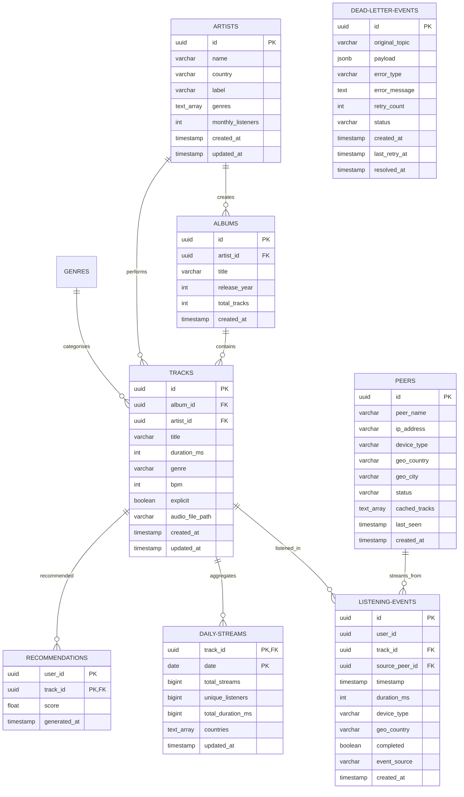

# Database Schema & Entity Relationship Diagram (ERD)

This document describes the relational database design for the SPOTIFY distributed data platform.

---

## 📊 Entity Relationship Diagram (ERD)

---

## 🗃️ Table Specifications & Types

### 1. `artists`
Stores music creator profiles.
- **Constraints**: Composite unique key on `(name, label)` to prevent duplicated catalog entries.
- **Data types**: `genres` is stored as a Postgres Text Array (`TEXT[]`) for flexible indexing.

### 2. `albums`
Aggregates tracks under a release structure.
- **Foreign Key**: `artist_id` references `artists(id)` with ON DELETE CASCADE.

### 3. `tracks`
Core music catalog items.
- **Foreign Key**: `album_id` (nullable for singles) and `artist_id` (mandatory).

### 4. `peers`
Simulated P2P network nodes.
- **Tracking**: `last_seen` timestamp to monitor active nodes.

### 5. `listening_events`
Transactional streams of play logs.
- **Partitioning Strategy**: Indexed on `date_trunc('hour', timestamp)` to enable efficient hourly batch execution.

### 6. `daily_streams`
Pre-aggregated catalog metrics for batch reporting.
- **Composite Primary Key**: `(track_id, date)` ensures single-day historical tracking.

### 7. `dead_letter_events` (DLQ)
Quarantines invalid, corrupted, or schema-mismatched events.
- **Data type**: `payload` uses binary JSON (`JSONB`) to store any malformed structure for analysis and reprocessing.
